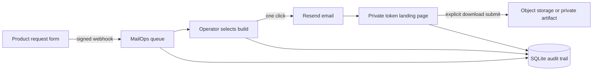

# AlphaNet MailOps

一个轻量、可自托管的软件交付管理台：集中接收下载申请，选择构建版本，自动生成收件人邮件和限时私有链接，并完整记录发送与下载行为。

Live admin: <https://mailops.alphanetplus.com><br>
Private download gateway: <https://download.alphanetplus.com>

> The public repository contains application code and deployment examples only. Production secrets, user data, SQLite databases, Cloudflare credentials, Resend keys, and private software builds are never committed.

## What it does

- Webhook intake with idempotent request IDs
- Queue, search, review, reject, and audit workflows
- Segmented customer replies for qualified RTX users, mobile compatibility guidance, and missing-device follow-up
- One-click delivery: recipient name, build, expiry, and private URL are filled automatically
- Editable global mail template with live preview
- Resend transactional email delivery
- 256-bit download tokens; only SHA-256 hashes are stored
- Expiry and maximum-download enforcement
- Two-step download confirmation so email security scanners do not consume an allowance
- External HTTPS object-storage targets or server-private `artifact:` files
- Firebase admin authentication plus an optional PBKDF2 local-admin fallback
- Dependency-free Python backend and static frontend

## Delivery flow



The email preview is materialized before sending. Operators see the real recipient name, selected build, expiry, and the fact that the private URL will be created on send; they do not manually replace `{placeholders}`.

## Quick start

```bash
cp .env.example .env
# Edit .env with your own Firebase, Resend, and webhook values.
set -a
. ./.env
set +a
python3 server.py
```

The service listens on `127.0.0.1:9400` by default.

## Request integration

Send product requests to the intake endpoint:

```http
POST /api/intake
Content-Type: application/json
X-MailOps-Secret: <shared secret>

{
  "requestId": "stable-source-id",
  "userId": "account-id",
  "email": "person@example.com",
  "recipientName": "Alex Chen",
  "machine": "Windows 11 / RTX 5090",
  "note": "Photo and video workflow",
  "createdAt": "2026-10-02T12:00:00Z",
  "source": "product/download"
}
```

`requestId` is the idempotency key. If `recipientName` is absent, MailOps derives a readable fallback from the email address.

## Build targets

Build records accept either:

- an `https://` object-storage URL; or
- `artifact:filename.zip` for a file inside `MAILOPS_ARTIFACT_ROOT`.

Private artifacts are streamed only after a valid token is checked. They are not exposed through a static public directory.

## Deployment

Example systemd and Cloudflare Tunnel files are in [`deploy/`](deploy/). The production pattern is:

```text
Cloudflare Tunnel
  ├── mailops.example.com  -> 127.0.0.1:9400
  └── download.example.com -> 127.0.0.1:9400

systemd
  └── python3 server.py
      ├── data/mailops.db
      └── data/artifacts/
```

See [`OPERATIONS.md`](OPERATIONS.md) for health checks, artifact replacement, and backup targets.

## Security model

- The backend binds to loopback; the tunnel is the only public ingress.
- Admin APIs require an allow-listed Firebase identity or a short-lived local session.
- Webhook secrets are compared with `hmac.compare_digest`.
- Download tokens are random and never stored in plaintext.
- Local artifact paths are canonicalized and reject traversal.
- Transactional email content is plain text plus escaped HTML.
- Email-link GET requests do not consume downloads; only the explicit POST action does.
- `.env`, databases, credentials, logs, and build binaries are ignored by Git.

## Project status

AlphaNet MailOps is running in production for the DLSS5 Studio request workflow. The included verification manifest is not the Studio application or an NVIDIA runtime; it exists only to test the delivery pipeline.

DLSS, RTX, GeForce, and NVIDIA are trademarks of NVIDIA Corporation. This project is independent and is not affiliated with or endorsed by NVIDIA.

## License

[MIT](LICENSE)
